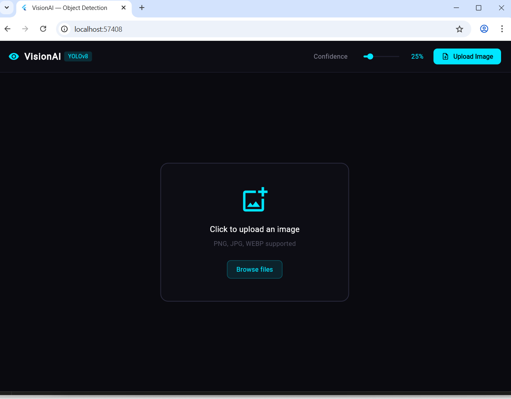
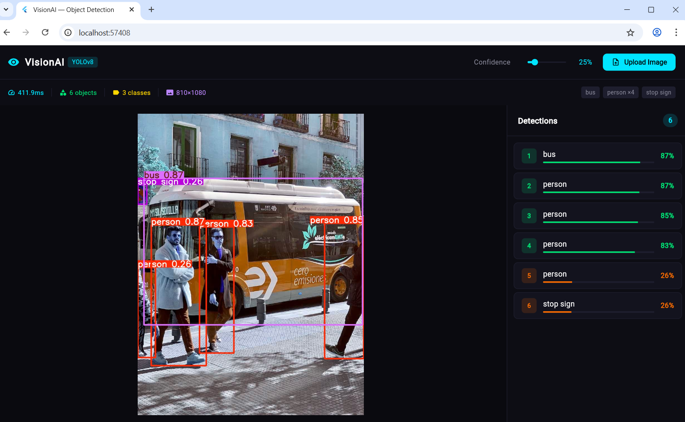

# VisionAI — Object Detection App

> Real-time object detection powered by YOLOv8 and Flask, with a Flutter Web frontend.
> Upload any image and get instant bounding box annotations with confidence scores.

---

## Screenshots

| Upload Screen | Detection Results |
|:---:|:---:|
|  |  |

---

## Prerequisites

Before you begin, make sure you have the following installed on your machine.

| Tool | Version | Download |
|------|---------|----------|
| Python | 3.9+ | <https://python.org> |
| Flutter | 3.x | <https://flutter.dev/docs/get-started/install> |
| Git | Any | <https://git-scm.com> |
| Google Chrome | Any | For Flutter Web |

Verify your installs by running:

```bash
python --version
flutter doctor
git --version
```

---

## Getting the Project

Clone the repository to your local machine:

```bash
git clone https://github.com/IrunguNjagi/vision-app.git
```

Navigate into the project folder:

```bash
cd vision-app
```

---

## Project Structure

```text
vision_app/
│
├── backend/                          # Python Flask API
│   ├── app.py                        # Server + detection logic
│   ├── requirements.txt              # Python dependencies
│   └── uploads/                      # Temp storage (auto-created)
│
└── flutter_app/                      # Flutter Web frontend
    ├── pubspec.yaml                  # Flutter dependencies
    └── lib/
        ├── main.dart                 # App entry point
        ├── screens/
        │   └── home_screen.dart      # Main UI
        └── services/
            └── detection_service.dart  # API calls to Flask
```

---

## Setup and Running

You will need **two terminals open** — one for the backend, one for the frontend.

---

### Terminal 1 — Backend (Flask)

**Step 1** — Navigate to the backend folder:

```bash
cd vision-app/backend
```

**Step 2** — Create a virtual environment:

```bash
python -m venv venv
```

**Step 3** — Activate the virtual environment:

```bash
# Mac / Linux
source venv/bin/activate

# Windows Command Prompt
venv\Scripts\activate.bat

# Windows PowerShell
venv\Scripts\Activate.ps1
```

You will see `(venv)` appear at the start of your terminal line when it is active.

**Step 4** — Install dependencies:

```bash
pip install -r requirements.txt
```

**Step 5** — Start the Flask server:

```bash
python app.py
```

Expected output:

```text
* Running on http://0.0.0.0:5000
* Press CTRL+C to quit
```

> **Note:** The YOLOv8 model (~6MB) will download automatically the first time you run the server.

---

### Terminal 2 — Frontend (Flutter Web)

**Step 1** — Open a new terminal and navigate to the Flutter app:

```bash
cd vision-app/flutter_app
```

**Step 2** — Install Flutter dependencies:

```bash
flutter pub get
```

**Step 3** — Enable Flutter Web (first time only):

```bash
flutter config --enable-web
```

**Step 4** — Run the app in Chrome:

```bash
flutter run -d chrome
```

Flutter will compile and automatically open the app in your browser.

---

## Using the App

**Step 1** — Make sure both the Flask server and Flutter app are running.

**Step 2** — In the browser, click **Upload Image**.

**Step 3** — Select any image in PNG, JPG, or WEBP format.

**Step 4** — The app sends the image to Flask, runs YOLOv8 detection, and displays:

- The annotated image with bounding boxes
- A list of detected objects with confidence scores
- Inference time and object count in the stats bar

**Step 5** — Use the **Confidence slider** in the top bar to adjust the detection threshold and re-run inference.

> **Test image:** If you don't have an image handy, use this official YOLOv8 sample:
> `https://ultralytics.com/images/bus.jpg`

---

## Stopping the App

To stop the Flutter app, press `CTRL+C` in Terminal 2.

To stop the Flask server, press `CTRL+C` in Terminal 1.

To deactivate the virtual environment:

```bash
deactivate
```

---

## Starting Again

Every time you want to run the project after the initial setup:

```bash
# Terminal 1 — Backend
cd vision-app/backend
source venv/bin/activate
python app.py

# Terminal 2 — Frontend
cd vision-app/flutter_app
flutter run -d chrome
```

---

## Common Issues

**`No module named 'Flask'`**

Your virtual environment is not activated. Run `source venv/bin/activate` before `python app.py`.

**CORS error in browser console**

Make sure the Flask server is running on port `5000` before launching Flutter.

**`flutter run` opens the wrong browser**

Specify Chrome explicitly with `flutter run -d chrome`.

**YOLOv8 model not downloading**

Check your internet connection. The model downloads automatically from Ultralytics on first run.

---

## License

MIT License — free to use, modify, and distribute.
